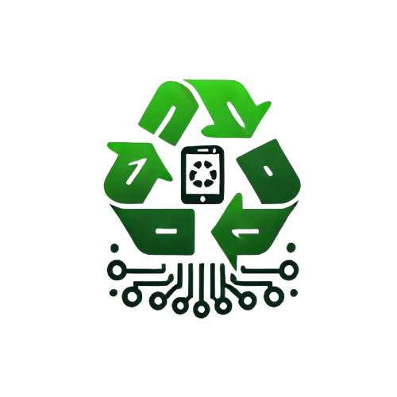

# Eco_Cycle

<p align="center">
  
</p>

## 🌱 About Eco_Cycle

Eco_Cycle is an AI-powered mobile application designed to revolutionize e-waste management through smart categorization, community engagement, and sustainable practices. Our mission is to reduce electronic waste's environmental impact by promoting responsible disposal, recycling, and reuse.

## 🔍 The Problem

Electronic waste is one of the fastest-growing waste streams globally, with millions of tons discarded annually. Most e-waste ends up in landfills, causing:
- Environmental pollution
- Health hazards
- Loss of valuable resources
- Missed opportunities for reuse and recycling

## 💡 Our Solution

Eco_Cycle provides an integrated platform that leverages AI technology to categorize e-waste and connect users with appropriate disposal methods, nearby facilities, and a marketplace for reuse and resale.

### Key Features

- **AI-Powered Waste Classification**: Accurately categorizes e-waste into recyclable and reducible components using image recognition
- **Nearby Disposal Facility Locator**: Connects users to the closest e-waste collection centers
- **In-App Marketplace**: Platform for selling and buying used electronics to promote reuse
- **Community Discussion Forum**: Space for NGOs, government organizations, and individuals to collaborate on sustainable waste management
- **Gamification**: Points system and leaderboards to encourage responsible disposal habits
- **Carbon Footprint Tracker**: AI-based tool to monitor environmental impact

## ⚡ What Sets Us Apart

- **Precision Classification**: AI-driven waste categorization for accurate sorting
- **Direct Connections**: Seamless integration with disposal facilities
- **Circular Economy**: Built-in marketplace encouraging product lifecycle extension
- **Community Engagement**: Dynamic platform for real-time collaboration
- **Incentivized Participation**: Gamification elements to maintain user engagement

## 🛠️ Technology Stack

- **Frontend**: Flutter for cross-platform mobile development
- **Backend**: Firebase for serverless architecture
- **AI/ML**: TensorFlow Lite for on-device image recognition
- **Maps**: Google Maps API for locating disposal centers
- **Database**: Cloud Firestore for real-time data storage
- **AI Services**: Gemini APIs for advanced AI capabilities
- **Development Platform**: IDX platform

## 🚀 Future Roadmap

- **E-Waste Collection Scheduling**: Implementation of pickup scheduling with partner organizations
- **Repair & Refurbishment Network**: Partnerships with technicians to extend device lifespans
- **Enhanced Analytics**: More detailed environmental impact metrics
- **Expanded Marketplace**: Additional features for the in-app marketplace
- **Educational Content**: Resources about e-waste management and sustainability

## 📱 Screenshots

<p align="center">
  
  
  
  
</p>


## 🔄 How It Works

1. **Scan**: Take a photo of your electronic waste
2. **Classify**: Our AI identifies the type of e-waste and its recyclability
3. **Locate**: Find the nearest appropriate disposal facility
4. **Dispose or Resell**: Choose to properly dispose of the item or list it on the marketplace
5. **Earn**: Gain points for responsible actions and climb the leaderboard

## 💻 Installation

```bash
# Clone the repository
git clone https://github.com/Akshit2807/Eco_Cycle.git

# Navigate to the project directory
cd Eco_Cycle

# Install dependencies
flutter pub get

# Run the app
flutter run
```
## 📲 Download the App

You can download the latest version of Eco_Cycle directly from our GitHub releases:

1. Visit the [Latest releases page](https://github.com/Akshit2807/Eco_Cycle/releases/latest)
2. Download the APK file from the Assets section
3. Install on your Android device ( you may need to enable installation from unknown sources in your device settings )
